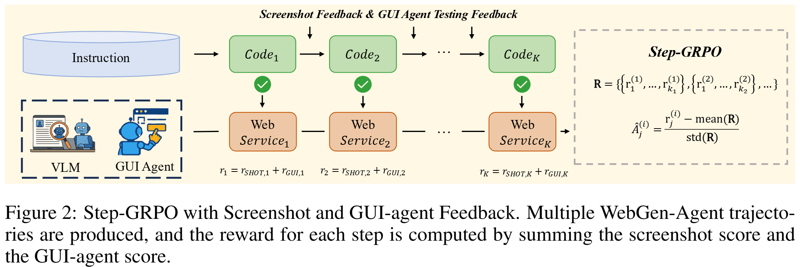

# WebGen-Agent

WebGen-Agent is an advanced website generation agent designed to autonomously create websites from natural language instructions. This repository contains both inference code for running the agent and training code for the Step-GRPO with Screenshot and GUI-agent Feedback approach. It is an official implementation of the paper [WebGen-Agent: Enhancing Interactive Website Generation with Multi-Level Feedback and Step-Level Reinforcement Learning](paper/WebGen_Agent.pdf)

## Project Overview

WebGen-Agent combines state-of-the-art language models with specialized training techniques to create a powerful website generation tool. The agent can understand natural language instructions specifying appearance and functional requirements, iteratively generate website codebases, and refine them using visual and functional feedback.


## Resources

Links to the data and model parameters are as follows:

| Data | HF Link |
|----------|------|
| webgen-agent_train_sft | 🤗 [luzimu/webgen-agent_train_sft](https://huggingface.co/datasets/luzimu/webgen-agent_train_sft) |
| webgen-agent_train_step-grpo | 🤗 [luzimu/webgen-agent_train_step-grpo](https://huggingface.co/datasets/luzimu/webgen-agent_train_step-grpo) |

| Model | HF Link |
|----------|------|
| WebGenAgent-LM-7B-SFT | 🤗 [luzimu/WebGenAgent-LM-7B-SFT](https://huggingface.co/luzimu/WebGenAgent-LM-7B-SFT) |
| WebGenAgent-LM-7B-Step-GRPO | 🤗 [luzimu/WebGenAgent-LM-7B-Step-GRPO](https://huggingface.co/luzimu/WebGenAgent-LM-7B-Step-GRPO) |
| WebGenAgent-LM-8B-SFT | 🤗 [luzimu/WebGenAgent-LM-8B-SFT](https://huggingface.co/luzimu/WebGenAgent-LM-8B-SFT) |
| WebGenAgent-LM-8B-Step-GRPO | 🤗 [luzimu/WebGenAgent-LM-8B-Step-GRPO](https://huggingface.co/luzimu/WebGenAgent-LM-8B-Step-GRPO) |

## Repository Structure

```
WebGen-Agent/
├── src/                    # Inference code for the WebGen-Agent workflow
│   ├── agent/              # Core agent implementation
│   ├── prompts/            # Prompt templates
│   ├── scripts/            # Utility scripts
│   ├── utils/              # Helper functions
│   ├── webvoyager/         # GUI agent integration
│   ├── infer_batch.py      # Batch inference script
│   └── infer_single.py     # Single inference script
├── requirements.txt        # Python dependencies for inference
├── data/
│   └── webgen-bench/       # WebGen-Bench dataset
└── WebGen-RL/              # Training code (Step-GRPO with Screenshot and GUI-agent Feedback)
    ├── src/
    │   ├── sft/            # Supervised Fine-Tuning code
    │   └── runs/           # GRPO training scripts
    └── ...
```

## Installation

1. Clone the repository:
   ```bash
   git clone https://github.com/your-username/WebGen-Agent.git
   cd WebGen-Agent
   ```

2. Create a conda environment:
   ```bash
   conda create -n env/webgen-agent python=3.10
   conda activate env/webgen-agent
   ```

3. Install the required dependencies:
   ```bash
   pip install -r requirements.txt
   ```

4. Node.js and google-chrome are also necessary for the project. You can install them by running:
   ```bash
   bash src/scripts/install_node.sh
   bash src/scripts/install_chrome.sh
   ```

## Running Inference

Before running inference, you should rename `.env.template` to `.env` and set the base urls and api keys for the agent-engine LLM and feedback VLM. They can be obtained from any openai-compatible providers such as [openrouter](https://openrouter.ai/), [modelscope](https://www.modelscope.cn/my/overview), [bailian](https://bailian.console.aliyun.com/#/home), and [llmprovider](https://llmprovider.ai/). You can also deploy open-source VLMs and LLMs by running `src/scripts/deploy_qwenvl_32b.sh` and `src/scripts/deploy.sh`. You can find example scripts for single inference and batch inference at `src/scripts/infer_single.sh` and `src/scripts/infer_batch.sh`.

### Single Inference

```bash
python src/infer_single.py \
    --model deepseek-chat \
    --vlm_model Qwen/Qwen2.5-VL-32B-Instruct \
    --instruction "Please implement a wheel of fortune website." \
    --workspace-dir workspaces_root/test \
    --log-dir service_logs/test \
    --max-iter 20 \
    --overwrite \
    --error-limit 5
```

### Batch Inference

```bash
python src/infer_batch.py \
    --model ${model_name} \
    --vlm_model Qwen/Qwen2.5-VL-32B-Instruct \
    --fb_model ${fb_model_name} \
    --data-path data/webgen-bench/test.jsonl \
    --workspace-root workspaces_root \
    --log-root service_logs \
    --max-iter 20 \
    --num-workers 4 \
    --eval-tag select_best \
    --error-limit 5 \
    --max-tokens -1 \
    --max-completion-tokens -1 \
    --temperature 0.5
```

## WebGen-RL (Step-GRPO with Screenshot and GUI-agent Feedback)

For Step-GRPO with Screenshot and GUI-agent Feedback training, please refer to the [WebGen-RL README](WebGen-RL/README.md).

The WebGen-RL component includes:
- Supervised Fine-Tuning (SFT) code in `WebGen-RL/src/sft/`
- GRPO training scripts in `WebGen-RL/src/runs/`



## How WebGen-Agent Works

WebGen-Agent follows an iterative, multi-step paradigm for website generation:

1. **Code Generation**: The agent generates code to create or edit website files based on natural language instructions
2. **Code Execution**: Dependencies are installed and the website service is started
3. **Feedback Gathering**: 
   - A screenshot of the website is captured
   - A Visual Language Model (VLM) provides appearance feedback and scores
   - A GUI-agent tests the website functionality and provides functional feedback
4. **Refinement**: Based on the feedback, the agent continues to improve the website until it meets requirements

## Key Features

- **Iterative Refinement**: Continuously improves website appearance and functionality
- **Feedback Integration**: Uses both visual and functional feedback for enhanced performance
- **Backtracking Mechanism**: Reverts to previous states when encountering persistent errors
- **Best Step Selection**: Selects the optimal version based on visual and functional scores

## Citation

If you find our project useful, please cite:

```
@misc{lu2025webgenbenchevaluatingllmsgenerating,
      title={WebGen-Bench: Evaluating LLMs on Generating Interactive and Functional Websites from Scratch}, 
      author={Zimu Lu and Yunqiao Yang and Houxing Ren and Haotian Hou and Han Xiao and Ke Wang and Weikang Shi and Aojun Zhou and Mingjie Zhan and Hongsheng Li},
      year={2025},
      eprint={2505.03733},
      archivePrefix={arXiv},
      primaryClass={cs.CL},
      url={https://arxiv.org/abs/2505.03733}, 
}
```