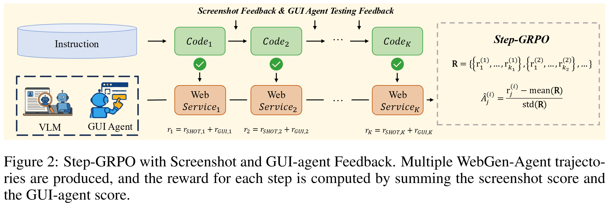

# WebGen-RL

WebGen-RL contains the training code for the Step-GRPO with Screenshot and GUI-agent Feedback approach used in the WebGen-Agent project.



## Overview

This component implements the Reinforcement Learning training pipeline for WebGen-Agent, including:
- Supervised Fine-Tuning (SFT)
- Step-GRPO with Screenshot and GUI-agent Feedback


## Repository Structure

```
WebGen-RL/
├── src/
│   ├── sft/                # Supervised Fine-Tuning code
│   │   ├── train.py
│   │   ├── config/
│   │   └── utils/
│   ├── runs/               # GRPO training scripts
│   │   ├── run_qwen2_5-coder-7b-instruct_step-grpo.sh
│   │   ├── run_qwen3-8b_step-grpo.sh
│   │   └── ...             # Other GRPO variants (ablation study)
│   └── install/            # Installation scripts
└── ...
```

## Installation

The installation process is detailed in `src/install/install.sh`. The key steps include:

1. Creating a conda environment with Python 3.10:
   ```bash
   conda create -n env/webgen-rl python=3.10
   conda activate env/webgen-rl
   ```

2. Installing PyTorch (find installation command matching your cuda version at [PyTorch](https://pytorch.org/)):
   ```bash
   pip install torch==2.6.0 torchvision==0.21.0 torchaudio==2.6.0 --index-url https://download.pytorch.org/whl/cu124
   ```

3. Installing NVIDIA Apex:
   ```bash
   git clone https://github.com/NVIDIA/apex.git
   cd apex
   MAX_JOB=32 pip install -v --disable-pip-version-check --no-cache-dir --no-build-isolation --config-settings "--build-option=--cpp_ext" --config-settings "--build-option=--cuda_ext" ./
   ```

4. Installing other dependencies:
   ```bash
   pip install --no-deps -e .
   bash scripts/install_vllm_sglang_mcore.sh
   pip install selenium
   pip install func_timeout
   pip install tensorboard
   ```

## Training

### Supervised Fine-Tuning (SFT)

Training scripts for SFT are located in `src/sft/`:

```bash
# Example for Qwen2.5-Coder-7B
bash src/sft/train_Qwen2_5-Coder-7B-Instruct_webgen-agent.sh

# Example for Qwen3-8B
bash src/sft/train_Qwen3-8B-Instruct_webgen-agent.sh
```

### Step-GRPO Training

Various GRPO training scripts are available in `src/runs/`:

```bash
# Main Step-GRPO approach (Step-GRPO with Screenshot and GUI-agent Feedback)
# WebGenAgent-LM-7B-Step-GRPO
bash src/runs/run_qwen2_5-coder-7b-instruct_step-grpo.sh

# WebGenAgent-LM-8B-Step-GRPO
bash src/runs/run_qwen3-8b_step-grpo.sh

# Ablation studies:
# Screenshot-only variant
bash src/runs/run_qwen2_5-coder-7b-instruct_screenshot-only-step-grpo.sh

# GUI-agent-only variant
bash src/runs/run_qwen2_5-coder-7b-instruct_gui-agent-only-step-grpo.sh

# Naive GRPO variant
bash src/runs/run_qwen2_5-coder-7b-instruct_naive-grpo.sh

# Cumulative advantage
bash src/runs/run_qwen2_5-coder-7b-instruct_cumulative-step-grpo.sh
```

## Step-GRPO with Screenshot and GUI-agent Feedback

WebGen-Agent generates websites through an iterative process where each step produces:
1. Code modifications to the website
2. Visual feedback (Screenshot Score) from a VLM
3. Functional feedback (GUI-agent Score) from a GUI-agent

The Step-GRPO approach uses these scores as step-level rewards:
- **Screenshot Score**: Quantifies the visual appeal and aesthetics of the website
- **GUI-agent Score**: Measures how well the website meets functional requirements

These dual rewards provide dense, reliable process supervision that significantly improves the model's ability to generate high-quality websites.

## Key Features

- **Step-GRPO Algorithm**: Implements Guided Reinforcement Learning with step-level rewards
- **Screenshot Integration**: Uses visual information from website screenshots for decision making
- **GUI-agent Feedback**: Incorporates functional testing feedback for improved training

## Citation

If you find our project useful, please cite:

```
@misc{lu2025webgenbenchevaluatingllmsgenerating,
      title={WebGen-Bench: Evaluating LLMs on Generating Interactive and Functional Websites from Scratch}, 
      author={Zimu Lu and Yunqiao Yang and Houxing Ren and Haotian Hou and Han Xiao and Ke Wang and Weikang Shi and Aojun Zhou and Mingjie Zhan and Hongsheng Li},
      year={2025},
      eprint={2505.03733},
      archivePrefix={arXiv},
      primaryClass={cs.CL},
      url={https://arxiv.org/abs/2505.03733}, 
}
```